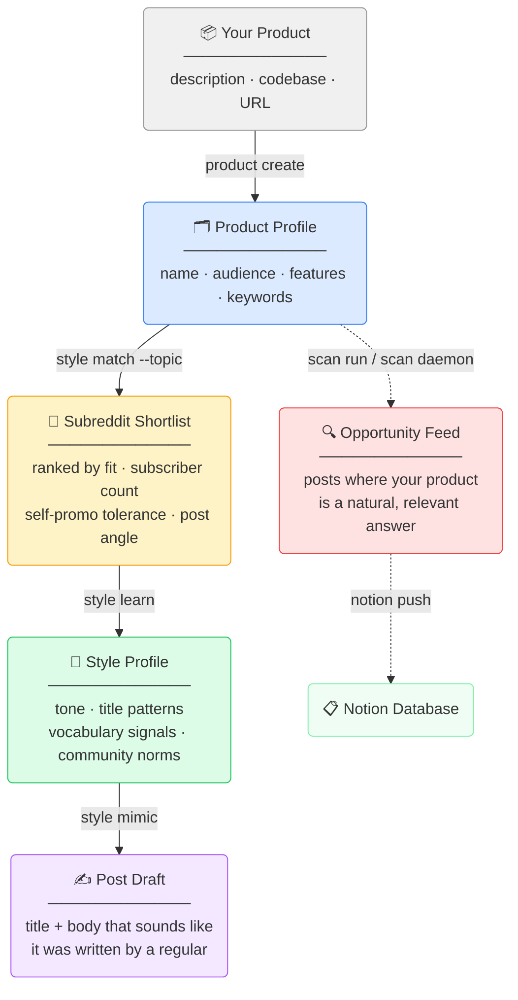

# reddit-toolkit

A CLI toolkit for indie hackers and marketers who want to do Reddit right.

Instead of guessing which subreddits to post in or writing posts that get flagged as spam, reddit-toolkit helps you understand a community deeply before you ever post — then generates content that actually fits.

---

## The Workflow

Reddit punishes outsiders. Every community has its own tone, vocabulary, and tolerance for self-promotion. The toolkit is built around a four-step workflow that respects that:



---

## Installation

```bash
pip install reddit-toolkit
```

Or from source:

```bash
git clone https://github.com/YoriHan/Reddit-
cd Reddit-
pip install -e .
```

**Required:** An [Anthropic API key](https://console.anthropic.com/) for all AI features.

```bash
export ANTHROPIC_API_KEY=sk-ant-...
```

---

## Step 1 — Define Your Product

Before anything else, create a product profile. This is what the AI uses to understand what you're building and who it's for.

**From a description:**
```bash
reddit-toolkit product create --name "MyApp" --description "A dev tool that auto-generates API docs from code comments"
```

**From your codebase (reads the actual code):**
```bash
reddit-toolkit product create --name "MyApp" --from-dir ./my-project
```

**From a URL (landing page, blog post, Product Hunt listing):**
```bash
reddit-toolkit product create --name "MyApp" --from-url https://myapp.com
```

The AI extracts your product's description, problem solved, target audience, key features, and keywords — then saves them as a profile you can reuse.

```bash
reddit-toolkit product list          # see all saved profiles
reddit-toolkit product show myapp   # inspect a profile
```

---

## Step 2 — Find the Right Subreddits

Don't guess. Use `style match` to find subreddits where your post topic would be genuinely welcomed — with real subscriber counts and self-promotion tolerance ratings pulled from Reddit.

```bash
reddit-toolkit style match --product myapp --topic "launch announcement"
```

```
Finding best subreddits for: launch announcement...

Top 5 subreddits for "launch announcement":

  1. r/SideProject — 142,000 subscribers
     Why: Community built for founders sharing what they've shipped
     Self-promo: high
     Angle: Share the problem you solved and what you learned building it

  2. r/webdev — 980,000 subscribers
     Why: Developers actively discuss tools that improve their workflow
     Self-promo: medium
     Angle: Lead with the technical challenge, mention the tool naturally

  3. r/programming — 6,200,000 subscribers
     Why: Large audience but skeptical of marketing — lead with substance
     Self-promo: low
     Angle: Write about the architecture decision, not the product

  ...

Next steps:
  reddit-toolkit style learn --subreddit SideProject
  reddit-toolkit style mimic --subreddit SideProject --product myapp --topic "launch announcement"
```

The output ends with the exact commands to run next. No copy-paste guessing.

---

## Step 3 — Learn How the Community Writes

This is the step most people skip — and why their posts get downvoted.

`style learn` fetches hundreds of top posts from a subreddit, then uses AI to build a style profile: the community's tone, what title formats work, what vocabulary signals you belong there, and how much self-promotion they'll tolerate.

```bash
reddit-toolkit style learn --subreddit SideProject
```

```
Fetching r/SideProject corpus (10 pages)...
  Fetching page 1/10...
  Fetching page 2/10...
  ...
  Fetched 243 posts total.
Analyzing writing style with AI...

Style profile saved for r/SideProject.
  Tone: casual, first-person, story-driven
  Self-promo tolerance: high
  Title patterns: 7 identified
  Vocabulary signals: shipped, built, months, feedback, free
```

Style profiles are cached locally so you don't re-fetch every time.

```bash
reddit-toolkit style list            # see all cached profiles
reddit-toolkit style show --subreddit SideProject   # inspect the full analysis
```

**Optional: Richer style data with PRAW**

If you have Reddit API credentials, the tool will also fetch top comments for the most popular posts — giving the AI a much deeper understanding of how people actually talk in that community.

```bash
export REDDIT_CLIENT_ID=your_id
export REDDIT_CLIENT_SECRET=your_secret
reddit-toolkit style learn --subreddit SideProject   # automatically uses PRAW when env vars are set
```

---

## Step 4 — Generate a Post That Fits

Now write. The AI combines your product profile with the subreddit's style profile to generate a post that sounds like it was written by a long-time community member.

```bash
reddit-toolkit style mimic --subreddit SideProject --product myapp --topic "launch announcement"
```

```
╭─ Mimic Post for r/SideProject ──────────────────────────────────╮
│                                                                  │
│ TITLE: I spent 3 months building the API docs tool I always     │
│ wanted — finally shipped it                                      │
│                                                                  │
│ Been lurking here for a while. Finally have something to share. │
│                                                                  │
│ I write a lot of internal tools at work and the thing that      │
│ always kills me is documentation...                             │
│                                                                  │
╰──────────────────────────────────────────────────────────────────╯
```

**No saved profile? Use inline description:**
```bash
reddit-toolkit style mimic --subreddit SideProject --describe "API doc generator for developers"
```

**Add a topic to steer the angle:**
```bash
reddit-toolkit style mimic --subreddit SideProject --product myapp --topic "asking for beta testers"
```

**Show why the AI thinks this fits:**
```bash
reddit-toolkit style mimic --subreddit SideProject --product myapp --verbose
```

---

## Ongoing: Scan for Opportunities

Once your product is set up, the scanner monitors your target subreddits and surfaces posts where your product is a natural, relevant answer.

```bash
reddit-toolkit scan run --product myapp --dry-run
```

```
Scan summary:
  Subreddits scanned: 5
  Posts fetched: 247
  New posts scored: 189
  Opportunities found: 3

  [8/10] "Is there any tool that generates docs automatically?"
  Hook: Direct pain point — user is actively looking for exactly this
  Draft title: "I built something for this..."

  [7/10] "How do you handle API documentation in your team?"
  Hook: Common frustration in the thread, good place to mention the tool naturally
  Draft title: "We had the same problem, here's what we ended up doing"
```

**Run on a schedule (no cron needed):**
```bash
reddit-toolkit scan daemon --product myapp --interval 8h
```

**Or set up a crontab line:**
```bash
reddit-toolkit scan setup-cron --product myapp --hour 9 --minute 0
```

**Push results to Notion:**
```bash
export NOTION_TOKEN=secret_...
reddit-toolkit notion setup --product myapp
reddit-toolkit scan run --product myapp --notion
```

---

## Other Commands

**Explore Reddit without a product:**

```bash
# Browse content
reddit-toolkit content hot --subreddit python --limit 20 --verbose
reddit-toolkit content top --subreddit startups --time week
reddit-toolkit content search "api documentation" --sort relevance

# Explore subreddits
reddit-toolkit subs search "developer tools"
reddit-toolkit subs explore "productivity"
reddit-toolkit subs info rust

# AI writing helpers (no profile needed)
reddit-toolkit write title --subreddit webdev --topic "my new CLI tool"
reddit-toolkit write body --subreddit webdev --title "Show HN style post"
reddit-toolkit write comment --post-title "Best practices for API design?" --tone supportive
```

---

## Configuration

| Variable | Required | Description |
|---|---|---|
| `ANTHROPIC_API_KEY` | Yes | Powers all AI features (style analysis, post generation, scanning) |
| `NOTION_TOKEN` | Optional | Push scan results to a Notion database |
| `REDDIT_CLIENT_ID` | Optional | Enables PRAW for richer style data (comment corpus) |
| `REDDIT_CLIENT_SECRET` | Optional | Required with `REDDIT_CLIENT_ID` |
| `REDDIT_USER_AGENT` | Optional | Custom user agent for PRAW (default: `reddit-toolkit/1.0`) |

All read-only Reddit access (content discovery, subreddit info) uses Reddit's public JSON API — no credentials needed.

---

## Data Storage

Profiles and scan state are stored locally in `~/.reddit-toolkit/`:

```
~/.reddit-toolkit/
  profiles/     # product profiles
  styles/       # cached subreddit style analyses
  state/        # scan history (deduplication + opportunity log)
```

Override the location:
```bash
export REDDIT_TOOLKIT_DATA_DIR=/your/path
```

---

## Contributing

Issues and PRs welcome. The codebase is straightforward Python — no frameworks, just `requests`, `anthropic`, and `rich`.

```bash
git clone https://github.com/YoriHan/Reddit-
cd Reddit-
pip install -e .
pip install pytest
pytest
```

---

## License

MIT
